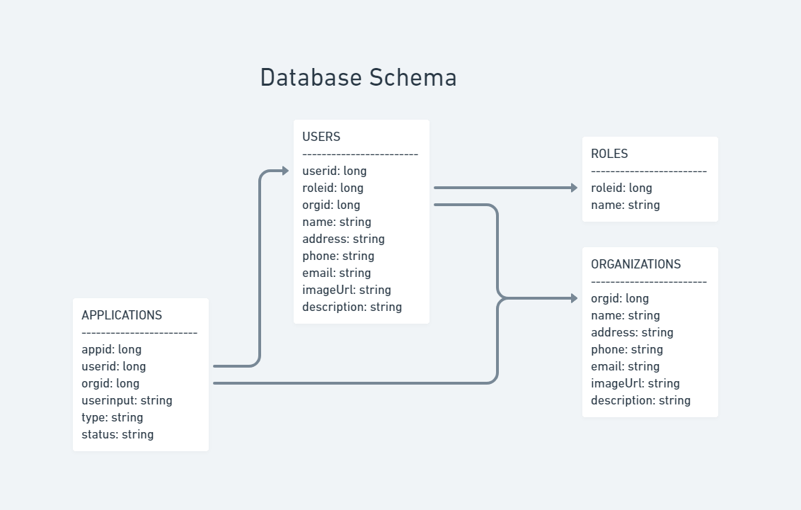

# Microfund

|                                                      [Kate McGee](https://github.com/KateAnn19)                                                       |                                                       [Shanon Fritz](https://github.com/sfritz24)                                                        |                                                      [Sam Kester](https://github.com/samkester)                                                       |                                                       [Anthony Navarro](https://github.com/arn-foto)                                                       |
|:-----------------------------------------------------------------------------------------------------------------------------------------: | :-------------------------------------------------------------------------------------------------------------------------------------------: | :-----------------------------------------------------------------------------------------------------------------------------------------: | :-------------------------------------------------------------------------------------------------------------------------------------------: |
| [](https://github.com/KateAnn19) | [](https://github.com/sfritz24) | [](https://github.com/samkester) | [](https://github.com/arn-foto) |
|                                [ ](https://github.com/KateAnn19)                                |                            [ ](https://github.com/sfritz24)                             |                          [ ](https://github.com/samkester)                           |                          [ ](https://github.com/arn-foto)                           |
|                [  ](https://www.linkedin.com/in/kate-mcgee/)                |                 [  ](https://www.linkedin.com/in/shanon-fritz/)                 |                [  ](https://www.linkedin.com/in/sam-kester/)                |                 [  ](https://www.linkedin.com/in/anthonyrnavarro/)                 |

## Introduction

Microfund API is built using Java Spring. It provides endpoints for the front-end client to read various data sets contained in the application's data.

### Database layout

Microfund is currently using this database layout. 




### Notes provided to us in the initial project scaffold
* The join table userroles is explicitly created. This allows us to add additional columns to the join table
* Since we are creating the join table ourselves, the Many to Many relationship that formed the join table is now two Many to One relationships
* All tables now have audit fields

Thus the new table layout is as follows

* User is the driving table.
* Users have a Many-To-Many relationship with Organizations. 
* Useremails have a Many-To-One relationship with User. Each User has many user email combinations. Each user email combination has only one User.
* Roles have a Many-To-Many relationship with Users.

### End Notes 
#

### This is the Database layout that was provided to us in the intial project scaffold


#

Using the provided seed data, expand each endpoint below to see the output it generates.

<details>
Base API -
<summary>https://microfund-b.herokuapp.com/users/all</summary>

```JSON
[
    {
        "userid": 7,
        "username": "admin@lambdaschool.local",
        "address": null,
        "phone": null,
        "imageUrl": null,
        "description": null,
        "useremails": [],
        "roles": [
            {
                "role": {
                    "roleid": 1,
                    "name": "ADMIN"
                }
            }
        ],
        "organizations": [
            {
                "orgid": 4,
                "name": "Organization 1",
                "address": "456 greenville drive, longtucky, ark 80067",
                "phone": "567-890-2234",
                "applications": [
                    {
                        "appid": 9,
                        "name": "Org 1",
                        "address": "123 somewhere drive",
                        "phone": "923-567-8965",
                        "reason": "i want to help my community",
                        "status": "not reviewed",
                        "user": {
                            "userid": 8,
                            "username": "coolorg@lambdaschool.local",
                            "address": null,
                            "phone": null,
                            "imageUrl": null,
                            "description": null,
                            "useremails": [],
                            "roles": [
                                {
                                    "role": {
                                        "roleid": 2,
                                        "name": "USER"
                                    }
                                }
                            ]
                        }
                    }
                ]
            }
        ],
        "applications": []
    }
]
```

</details>

<details>
<summary>https://microfund-b.herokuapp.com/users/user/8</summary>

```JSON
{
    "userid": 8,
    "username": "coolorg@lambdaschool.local",
    "address": null,
    "phone": null,
    "imageUrl": null,
    "description": null,
    "useremails": [],
    "roles": [
        {
            "role": {
                "roleid": 2,
                "name": "USER"
            }
        }
    ],
    "organizations": [
        {
            "orgid": 5,
            "name": "Organization 2",
            "address": "4 takona lane, nashville, tn 12546",
            "phone": "333-222-1111",
            "applications": [
                {
                    "appid": 10,
                    "name": "Org 2",
                    "address": "124 rainbow lane",
                    "phone": "444-111-3333",
                    "reason": "i have a great idea i need help with",
                    "status": "not reviewed",
                    "user": {
                        "userid": 8,
                        "username": "coolorg@lambdaschool.local",
                        "address": null,
                        "phone": null,
                        "imageUrl": null,
                        "description": null,
                        "useremails": [],
                        "roles": [
                            {
                                "role": {
                                    "roleid": 2,
                                    "name": "USER"
                                }
                            }
                        ]
                    }
                }
            ]
        }
    ],
    "applications": [
        {
            "appid": 9,
            "name": "Org 1",
            "address": "123 somewhere drive",
            "phone": "923-567-8965",
            "reason": "i want to help my community",
            "status": "not reviewed",
            "organization": {
                "orgid": 4,
                "name": "Organization 1",
                "address": "456 greenville drive, longtucky, ark 80067",
                "phone": "567-890-2234"
            }
        },
        {
            "appid": 10,
            "name": "Org 2",
            "address": "124 rainbow lane",
            "phone": "444-111-3333",
            "reason": "i have a great idea i need help with",
            "status": "not reviewed",
            "organization": {
                "orgid": 5,
                "name": "Organization 2",
                "address": "4 takona lane, nashville, tn 12546",
                "phone": "333-222-1111"
            }
        }
    ]
}
```

</details>


<details>
<summary>https://microfund-b.herokuapp.com/users/user/name/coolorg@lambdaschool.local</summary>

```JSON
{
    "userid": 8,
    "username": "coolorg@lambdaschool.local",
    "address": null,
    "phone": null,
    "imageUrl": null,
    "description": null,
    "useremails": [],
    "roles": [
        {
            "role": {
                "roleid": 2,
                "name": "USER"
            }
        }
    ],
    "organizations": [
        {
            "orgid": 5,
            "name": "Organization 2",
            "address": "4 takona lane, nashville, tn 12546",
            "phone": "333-222-1111",
            "applications": [
                {
                    "appid": 10,
                    "name": "Org 2",
                    "address": "124 rainbow lane",
                    "phone": "444-111-3333",
                    "reason": "i have a great idea i need help with",
                    "status": "not reviewed",
                    "user": {
                        "userid": 8,
                        "username": "coolorg@lambdaschool.local",
                        "address": null,
                        "phone": null,
                        "imageUrl": null,
                        "description": null,
                        "useremails": [],
                        "roles": [
                            {
                                "role": {
                                    "roleid": 2,
                                    "name": "USER"
                                }
                            }
                        ]
                    }
                }
            ]
        }
    ],
    "applications": [
        {
            "appid": 9,
            "name": "Org 1",
            "address": "123 somewhere drive",
            "phone": "923-567-8965",
            "reason": "i want to help my community",
            "status": "not reviewed",
            "organization": {
                "orgid": 4,
                "name": "Organization 1",
                "address": "456 greenville drive, longtucky, ark 80067",
                "phone": "567-890-2234"
            }
        },
        {
            "appid": 10,
            "name": "Org 2",
            "address": "124 rainbow lane",
            "phone": "444-111-3333",
            "reason": "i have a great idea i need help with",
            "status": "not reviewed",
            "organization": {
                "orgid": 5,
                "name": "Organization 2",
                "address": "4 takona lane, nashville, tn 12546",
                "phone": "333-222-1111"
            }
        }
    ]
}
```

</details>
<details>
<summary>https://microfund-b.herokuapp.com/users/user/name/like/cool</summary>

```JSON
[
    {
        "userid": 8,
        "username": "coolorg@lambdaschool.local",
        "address": null,
        "phone": null,
        "imageUrl": null,
        "description": null,
        "useremails": [],
        "roles": [
            {
                "role": {
                    "roleid": 2,
                    "name": "USER"
                }
            }
        ],
        "organizations": [
            {
                "orgid": 5,
                "name": "Organization 2",
                "address": "4 takona lane, nashville, tn 12546",
                "phone": "333-222-1111",
                "applications": [
                    {
                        "appid": 10,
                        "name": "Org 2",
                        "address": "124 rainbow lane",
                        "phone": "444-111-3333",
                        "reason": "i have a great idea i need help with",
                        "status": "not reviewed",
                        "user": {
                            "userid": 8,
                            "username": "coolorg@lambdaschool.local",
                            "address": null,
                            "phone": null,
                            "imageUrl": null,
                            "description": null,
                            "useremails": [],
                            "roles": [
                                {
                                    "role": {
                                        "roleid": 2,
                                        "name": "USER"
                                    }
                                }
                            ]
                        }
                    }
                ]
            }
        ],
        "applications": [
            {
                "appid": 9,
                "name": "Org 1",
                "address": "123 somewhere drive",
                "phone": "923-567-8965",
                "reason": "i want to help my community",
                "status": "not reviewed",
                "organization": {
                    "orgid": 4,
                    "name": "Organization 1",
                    "address": "456 greenville drive, longtucky, ark 80067",
                    "phone": "567-890-2234"
                }
            },
            {
                "appid": 10,
                "name": "Org 2",
                "address": "124 rainbow lane",
                "phone": "444-111-3333",
                "reason": "i have a great idea i need help with",
                "status": "not reviewed",
                "organization": {
                    "orgid": 5,
                    "name": "Organization 2",
                    "address": "4 takona lane, nashville, tn 12546",
                    "phone": "333-222-1111"
                }
            }
        ]
    },
    {
        "userid": 11,
        "username": "evencoolerorg@lambdaschool.local",
        "address": null,
        "phone": null,
        "imageUrl": null,
        "description": null,
        "useremails": [],
        "roles": [
            {
                "role": {
                    "roleid": 3,
                    "name": "PARTNER"
                }
            }
        ],
        "organizations": [
            {
                "orgid": 6,
                "name": "Organization 3",
                "address": "678 snowyhille crossing, boulder, c0 80053",
                "phone": "888-999-1111",
                "applications": [
                    {
                        "appid": 12,
                        "name": "Org 3",
                        "address": "534 abbey road",
                        "phone": "000-345-9807",
                        "reason": "i would love to be a part of this",
                        "status": "not reviewed",
                        "user": {
                            "userid": 11,
                            "username": "evencoolerorg@lambdaschool.local",
                            "address": null,
                            "phone": null,
                            "imageUrl": null,
                            "description": null,
                            "useremails": [],
                            "roles": [
                                {
                                    "role": {
                                        "roleid": 3,
                                        "name": "PARTNER"
                                    }
                                }
                            ]
                        }
                    }
                ]
            }
        ],
        "applications": [
            {
                "appid": 12,
                "name": "Org 3",
                "address": "534 abbey road",
                "phone": "000-345-9807",
                "reason": "i would love to be a part of this",
                "status": "not reviewed",
                "organization": {
                    "orgid": 6,
                    "name": "Organization 3",
                    "address": "678 snowyhille crossing, boulder, c0 80053",
                    "phone": "888-999-1111"
                }
            }
        ]
    }
]
```
</details>
<details>
<summary>https://microfund-b.herokuapp.com/users/getuserinfo</summary>

```JSON
{
    "userid": 8,
    "username": "coolorg@lambdaschool.local",
    "address": null,
    "phone": null,
    "imageUrl": null,
    "description": null,
    "useremails": [],
    "roles": [
        {
            "role": {
                "roleid": 2,
                "name": "USER"
            }
        }
    ],
    "organizations": [
        {
            "orgid": 5,
            "name": "Organization 2",
            "address": "4 takona lane, nashville, tn 12546",
            "phone": "333-222-1111",
            "applications": [
                {
                    "appid": 10,
                    "name": "Org 2",
                    "address": "124 rainbow lane",
                    "phone": "444-111-3333",
                    "reason": "i have a great idea i need help with",
                    "status": "not reviewed",
                    "user": {
                        "userid": 8,
                        "username": "coolorg@lambdaschool.local",
                        "address": null,
                        "phone": null,
                        "imageUrl": null,
                        "description": null,
                        "useremails": [],
                        "roles": [
                            {
                                "role": {
                                    "roleid": 2,
                                    "name": "USER"
                                }
                            }
                        ]
                    }
                }
            ]
        }
    ],
    "applications": [
        {
            "appid": 9,
            "name": "Org 1",
            "address": "123 somewhere drive",
            "phone": "923-567-8965",
            "reason": "i want to help my community",
            "status": "not reviewed",
            "organization": {
                "orgid": 4,
                "name": "Organization 1",
                "address": "456 greenville drive, longtucky, ark 80067",
                "phone": "567-890-2234"
            }
        },
        {
            "appid": 10,
            "name": "Org 2",
            "address": "124 rainbow lane",
            "phone": "444-111-3333",
            "reason": "i have a great idea i need help with",
            "status": "not reviewed",
            "organization": {
                "orgid": 5,
                "name": "Organization 2",
                "address": "4 takona lane, nashville, tn 12546",
                "phone": "333-222-1111"
            }
        }
    ]
}

```

</details>

<details>
<summary>https://microfund-b.herokuapp.com/users/user/8/apps</summary>

```JSON
[
    {
        "appid": 9,
        "name": "Org 1",
        "address": "123 somewhere drive",
        "phone": "923-567-8965",
        "reason": "i want to help my community",
        "status": "not reviewed",
        "organization": {
            "orgid": 4,
            "name": "Organization 1",
            "address": "456 greenville drive, longtucky, ark 80067",
            "phone": "567-890-2234"
        },
        "user": {
            "userid": 8,
            "username": "coolorg@lambdaschool.local",
            "address": null,
            "phone": null,
            "imageUrl": null,
            "description": null,
            "useremails": [],
            "roles": [
                {
                    "role": {
                        "roleid": 2,
                        "name": "USER"
                    }
                }
            ]
        }
    },
    {
        "appid": 10,
        "name": "Org 2",
        "address": "124 rainbow lane",
        "phone": "444-111-3333",
        "reason": "i have a great idea i need help with",
        "status": "not reviewed",
        "organization": {
            "orgid": 5,
            "name": "Organization 2",
            "address": "4 takona lane, nashville, tn 12546",
            "phone": "333-222-1111"
        },
        "user": {
            "userid": 8,
            "username": "coolorg@lambdaschool.local",
            "address": null,
            "phone": null,
            "imageUrl": null,
            "description": null,
            "useremails": [],
            "roles": [
                {
                    "role": {
                        "roleid": 2,
                        "name": "USER"
                    }
                }
            ]
        }
    }
]

```

</details>


##### Currently, the way Okta is setup and implemented, it would not allow the creation of new users from the front-end. 
<details>
<summary>POST https://microfund-b.herokuapp.com/users/user</summary>

DATA

```JSON
{
    "username":"NEWUSER"
}
```

OUTPUT

```TEXT
Status CREATED
```
</details>


<details>
<summary>PUT https://microfund-b.herokuapp.com/users/user/8</summary>

DATA

```JSON
{
    "userid": 8,
    "username": "coolorg@lambdaschool.local",
    "address": "123 Here We Are Drive, School, Texas 95678",
    "phone": null,
    "imageUrl": null,
    "description": null,
    "useremails": [],
    "roles": [
        {
            "role": {
                "roleid": 2,
                "name": "USER"
            }
        }
    ],
    "organizations": [
        {
            "orgid": 5,
            "name": "Organization 2",
            "address": "4 takona lane, nashville, tn 12546",
            "phone": "333-222-1111",
            "applications": [
                {
                    "appid": 10,
                    "name": "Org 2",
                    "address": "124 rainbow lane",
                    "phone": "444-111-3333",
                    "reason": "i have a great idea i need help with",
                    "status": "not reviewed",
                    "user": {
                        "userid": 8,
                        "username": "coolorg@lambdaschool.local",
                        "address": null,
                        "phone": null,
                        "imageUrl": null,
                        "description": null,
                        "useremails": [],
                        "roles": [
                            {
                                "role": {
                                    "roleid": 2,
                                    "name": "USER"
                                }
                            }
                        ]
                    }
                }
            ]
        }
    ],
    "applications": [
        {
            "appid": 9,
            "name": "Org 1",
            "address": "123 somewhere drive",
            "phone": "923-567-8965",
            "reason": "i want to help my community",
            "status": "not reviewed",
            "organization": {
                "orgid": 4,
                "name": "Organization 1",
                "address": "456 greenville drive, longtucky, ark 80067",
                "phone": "567-890-2234"
            }
        },
        {
            "appid": 10,
            "name": "Org 2",
            "address": "124 rainbow lane",
            "phone": "444-111-3333",
            "reason": "i have a great idea i need help with",
            "status": "not reviewed",
            "organization": {
                "orgid": 5,
                "name": "Organization 2",
                "address": "4 takona lane, nashville, tn 12546",
                "phone": "333-222-1111"
            }
        }
    ]
}
```

OUTPUT

```TEXT
Status OK
```
</details>

<details>
<summary>PATCH https://microfund-b.herokuapp.com/users/user/8</summary>

DATA

```JSON
 {"phone": "333-200-1112"}
```

OUTPUT

```TEXT
Status OK
```

</details>

<details>
<summary>DELETE https://microfund-b.herokuapp.com/users/user/8</summary>

```TEXT
No Body Data

Status OK
```

</details>

---
<details>
<summary>https://microfund-b.herokuapp.com/apps/all</summary>

```JSON
[
    {
        "appid": 9,
        "name": "Org 1",
        "address": "123 somewhere drive",
        "phone": "923-567-8965",
        "reason": "i want to help my community",
        "status": "not reviewed",
        "organization": {
            "orgid": 4,
            "name": "Organization 1",
            "address": "456 greenville drive, longtucky, ark 80067",
            "phone": "567-890-2234"
        },
        "user": {
            "userid": 8,
            "username": "coolorg@lambdaschool.local",
            "address": null,
            "phone": null,
            "imageUrl": null,
            "description": null,
            "useremails": [],
            "roles": [
                {
                    "role": {
                        "roleid": 2,
                        "name": "USER"
                    }
                }
            ]
        }
    },
    {
        "appid": 10,
        "name": "Org 2",
        "address": "124 rainbow lane",
        "phone": "444-111-3333",
        "reason": "i have a great idea i need help with",
        "status": "not reviewed",
        "organization": {
            "orgid": 5,
            "name": "Organization 2",
            "address": "4 takona lane, nashville, tn 12546",
            "phone": "333-222-1111"
        },
        "user": {
            "userid": 8,
            "username": "coolorg@lambdaschool.local",
            "address": null,
            "phone": null,
            "imageUrl": null,
            "description": null,
            "useremails": [],
            "roles": [
                {
                    "role": {
                        "roleid": 2,
                        "name": "USER"
                    }
                }
            ]
        }
    },
    {
        "appid": 12,
        "name": "Org 3",
        "address": "534 abbey road",
        "phone": "000-345-9807",
        "reason": "i would love to be a part of this",
        "status": "not reviewed",
        "organization": {
            "orgid": 6,
            "name": "Organization 3",
            "address": "678 snowyhille crossing, boulder, c0 80053",
            "phone": "888-999-1111"
        },
        "user": {
            "userid": 11,
            "username": "evencoolerorg@lambdaschool.local",
            "address": null,
            "phone": null,
            "imageUrl": null,
            "description": null,
            "useremails": [],
            "roles": [
                {
                    "role": {
                        "roleid": 3,
                        "name": "PARTNER"
                    }
                }
            ]
        }
    }
]
```

</details>

<details>
<summary>https://microfund-b.herokuapp.com/apps/app/9</summary>

```JSON

```

</details>

<details>
<summary>POST https://microfund-b.herokuapp.com/app/new</summary>

DATA

```JSON
{
"name": "New Micro-entrepenuer",
"address": "543 Loveland Drive, Lindy, Texas 6789",
"phone": "777-444-2222",
"reason": "I've always wanted to start my own business",
"status": "new",
"organization": {
                "orgid": 5,
                "name": "Organization 2",
                "address": "4 takona lane, nashville, tn 12546",
                "phone": "333-222-1111"
                },
"user":{
           "userid": 8,
           "username": "coolorg@lambdaschool.local",
           "address": "123 Here We Are Drive, School, Texas 95678",
           "phone": null,
           "imageUrl": null,
           "description": null,
           "useremails": [],
           "roles": [
               {
                   "role": {
                       "roleid": 2,
                       "name": "USER"
                   }
               }
           ]
         }
}
```

OUTPUT

```TEXT
Status CREATED
```

</details>

<details>
<summary>PATCH https://microfund-b.herokuapp.com/apps/app/9/status</summary>

DATA

```JSON
{"status": "approved"}

```

OUTPUT

```TEXT
Status OK
```

</details>

<details>
<summary>PATCH https://microfund-b.herokuapp.com/apps/app/9</summary>

DATA

```JSON
{"phone": "444-000-2222"}
```

OUTPUT

```TEXT
Status OK
```

</details>

---
<details>
<summary>https://microfund-b.herokuapp.com/orgs/all</summary>

```JSON

```

</details>

<details>
<summary>https://microfund-b.herokuapp.com/orgs/org/9/users</summary>

```JSON

```

</details>

<details>
<summary>https://microfund-b.herokuapp.com/orgs/org/9</summary>

```JSON

```

</details>

<details>
<summary>https://microfund-b.herokuapp.com/orgs/org/9/apps</summary>

```JSON

```

</details>

<details>
<summary>POST https://microfund-b.herokuapp.com/orgs/org</summary>

DATA

```JSON

```

OUTPUT

```TEXT
Status OK
```

</details>

<details>
<summary>PATCH https://microfund-b.herokuapp.com/orgs/org/9</summary>

DATA

```JSON

```
OUTPUT

```TEXT
Status OK
```
</details>

<details>
<summary>DELETE https://microfund-b.herokuapp.com/orgs/org/8</summary>

```TEXT
No Body Data

Status OK
```

</details>

---
##### These endpoints were provided with the project scaffold. They have not been tested, altered or implemented in the front-end client at this time though the JSON input/output for each has changed/will need to change due to a change in the data models. Therefore, we are noting the endpoints but not the JSON object sent or returned because these will have changed/will need to change slightly. If you wish to implement any of these, we believe it would be fairly easy to do. 

<details>
<summary>http://localhost:2019/roles/roles</summary>

```JSON
[
    {
        "roleid": 1,
        "name": "ADMIN",
        "users": [
            {
                "user": {
                    "userid": 4,
                    "username": "admin",
                    "primaryemail": "admin@lambdaschool.local",
                    "useremails": [
                        {
                            "useremailid": 5,
                            "useremail": "admin@email.local"
                        },
                        {
                            "useremailid": 6,
                            "useremail": "admin@mymail.local"
                        }
                    ]
                }
            }
        ]
    },
    {
        "roleid": 2,
        "name": "USER",
        "users": [
            {
                "user": {
                    "userid": 14,
                    "username": "misskitty",
                    "primaryemail": "misskitty@school.lambda",
                    "useremails": [
                        {
                            "useremailid": 15,
                            "useremail": "favbun@hops.local"
                        }
                    ]
                }
            },
            {
                "user": {
                    "userid": 13,
                    "username": "puttat",
                    "primaryemail": "puttat@school.lambda",
                    "useremails": []
                }
            },
            {
                "user": {
                    "userid": 11,
                    "username": "barnbarn",
                    "primaryemail": "barnbarn@lambdaschool.local",
                    "useremails": [
                        {
                            "useremailid": 12,
                            "useremail": "barnbarn@email.local"
                        }
                    ]
                }
            },
            {
                "user": {
                    "userid": 7,
                    "username": "cinnamon",
                    "primaryemail": "cinnamon@lambdaschool.local",
                    "useremails": [
                        {
                            "useremailid": 9,
                            "useremail": "favbun@hops.local"
                        },
                        {
                            "useremailid": 10,
                            "useremail": "bunny@email.local"
                        }
                    ]
                }
            },
            {
                "user": {
                    "userid": 4,
                    "username": "admin",
                    "primaryemail": "admin@lambdaschool.local",
                    "useremails": [
                        {
                            "useremailid": 5,
                            "useremail": "admin@email.local"
                        },
                        {
                            "useremailid": 6,
                            "useremail": "admin@mymail.local"
                        }
                    ]
                }
            }
        ]
    },
    {
        "roleid": 3,
        "name": "DATA",
        "users": [
            {
                "user": {
                    "userid": 4,
                    "username": "admin",
                    "primaryemail": "admin@lambdaschool.local",
                    "useremails": [
                        {
                            "useremailid": 5,
                            "useremail": "admin@email.local"
                        },
                        {
                            "useremailid": 6,
                            "useremail": "admin@mymail.local"
                        }
                    ]
                }
            },
            {
                "user": {
                    "userid": 7,
                    "username": "cinnamon",
                    "primaryemail": "cinnamon@lambdaschool.local",
                    "useremails": [
                        {
                            "useremailid": 9,
                            "useremail": "favbun@hops.local"
                        },
                        {
                            "useremailid": 10,
                            "useremail": "bunny@email.local"
                        }
                    ]
                }
            }
        ]
    }
]
```

</details>

<details>
<summary>http://localhost:2019/roles/role/3</summary>

```JSON
{
    "roleid": 3,
    "name": "DATA",
    "users": [
        {
            "user": {
                "userid": 4,
                "username": "admin",
                "primaryemail": "admin@lambdaschool.local",
                "useremails": [
                    {
                        "useremailid": 5,
                        "useremail": "admin@email.local"
                    },
                    {
                        "useremailid": 6,
                        "useremail": "admin@mymail.local"
                    }
                ]
            }
        },
        {
            "user": {
                "userid": 7,
                "username": "cinnamon",
                "primaryemail": "cinnamon@lambdaschool.local",
                "useremails": [
                    {
                        "useremailid": 9,
                        "useremail": "favbun@hops.local"
                    },
                    {
                        "useremailid": 10,
                        "useremail": "bunny@email.local"
                    }
                ]
            }
        }
    ]
}
```

</details>

<details>
<summary>http://localhost:2019/roles/role/name/data</summary>

```JSON
{
    "roleid": 3,
    "name": "DATA",
    "users": [
        {
            "user": {
                "userid": 4,
                "username": "admin",
                "primaryemail": "admin@lambdaschool.local",
                "useremails": [
                    {
                        "useremailid": 5,
                        "useremail": "admin@email.local"
                    },
                    {
                        "useremailid": 6,
                        "useremail": "admin@mymail.local"
                    }
                ]
            }
        },
        {
            "user": {
                "userid": 7,
                "username": "cinnamon",
                "primaryemail": "cinnamon@lambdaschool.local",
                "useremails": [
                    {
                        "useremailid": 9,
                        "useremail": "favbun@hops.local"
                    },
                    {
                        "useremailid": 10,
                        "useremail": "bunny@email.local"
                    }
                ]
            }
        }
    ]
}
```

</details>

<details>
<summary>POST http://localhost:2019/roles/role</summary>

DATA

```JSON
{
    "name" : "ANewRole"
}
```

OUTPUT

```TEXT
Status CREATED

Location Header: http://localhost:2019/roles/role/16
```

</details>

<details>
<summary>http://localhost:2019/roles/role/name/anewrole</summary>

```JSON
{
    "roleid": 16,
    "name": "ANEWROLE",
    "users": []
}
```

</details>

<details>
<summary>PUT http://localhost:2019/roles/role/16</summary>

DATA

```JSON
{
    "name" : "ANewRole"
}
```

OUTPUT

```TEXT
Status OK
```

</details>

---

##### These endpoints were provided with the project scaffold. They have not been tested, altered or implemented in the front-end client at this time though the JSON input/output for each has changed/will need to change due to a change in the data models. Therefore, we are noting the endpoints but not the JSON object sent or returned because these will have changed/will need to change slightly. If you wish to implement any of these, we believe it would be fairly easy to do. 
<details>
<summary>http://localhost:2019/useremails/useremails</summary>

```JSON

```

</details>

<details>
<summary>http://localhost:2019/useremails/useremail/8</summary>

```JSON

```

</details>

<details>
<summary>DELETE http://localhost:2019/useremails/useremail/8</summary>

```TEXT
No Body Data

Status OK
```

</details>


<details>
<summary>PUT http://localhost:2019/useremails/useremail/9/email/favbun@hops.local</summary>

DATA

```JSON

```

OUTPUT

```TEXT
Status OK
```

</details>

<details>
<summary>http://localhost:2019/useremails/useremail/9</summary>

```JSON

```

</details>

<details>
<summary>POST http://localhost:2019/useremails/user/14/email/favbun@hops.local</summary>

OUTPUT

```TEXT
Status CREATED

Location Header: http://localhost:2019/useremails/useremail/15
```

</details>

<details>
<summary>http://localhost:2019/useremails/useremail/15</summary>

```JSON

```

</details>


